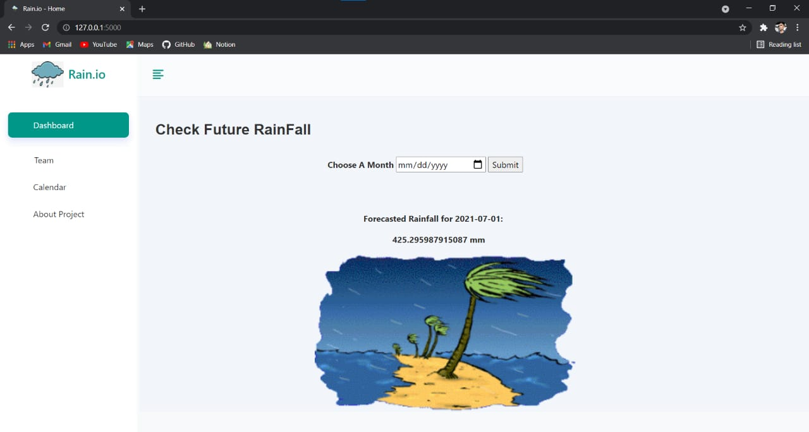

# rainfall
This is College PBL project

# Screenshot of the code (ML)
Machine learning (ARIMA) is used for predictiing the rainfall and front end for the user interactivity.
front end :- HTML, CSS, JAVASCRIPT, BOOTSTRAP
Backe end :- PYTHON, FLASK.

# Front End 

